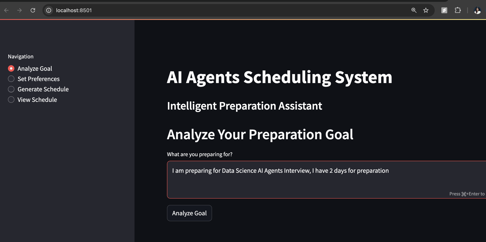
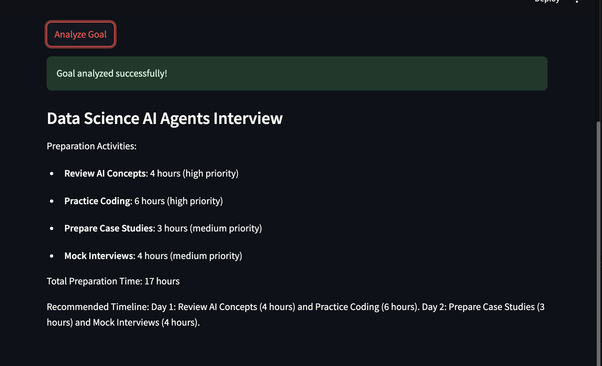
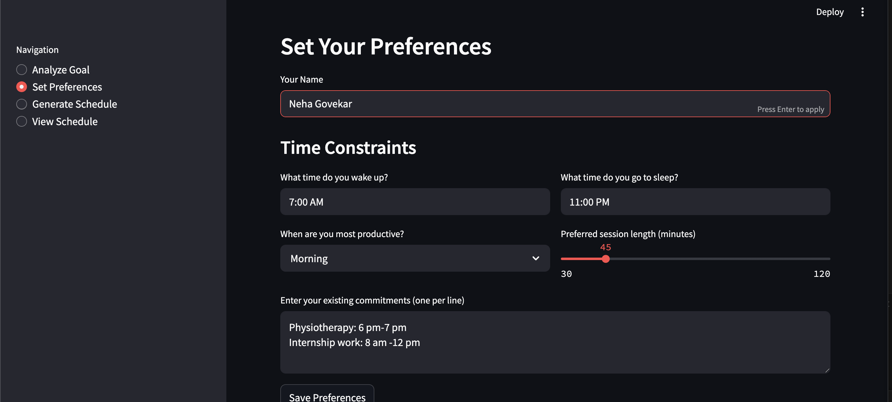
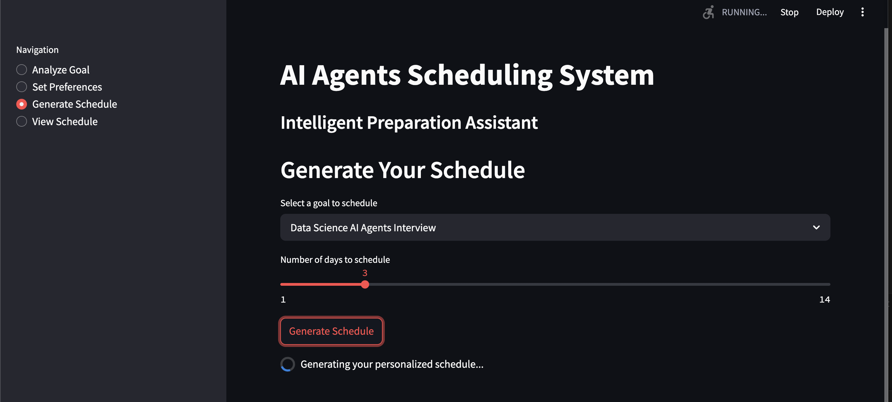
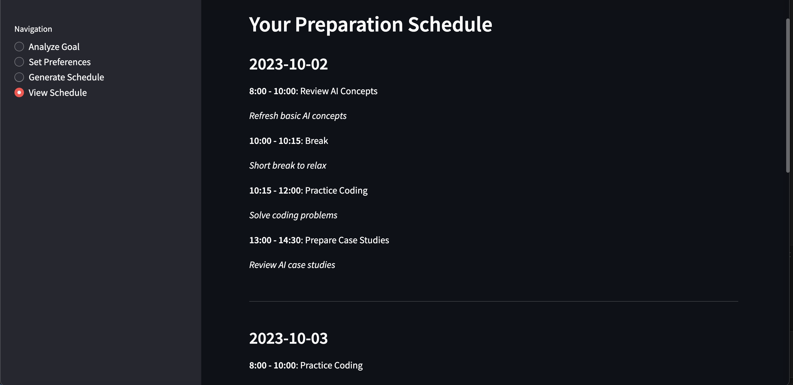

# AI Agents Scheduling System: Intelligent Preparation Assistant

A multi-agent AI system that helps users create personalized preparation schedules for goals such as exams, interviews, or presentations.

## Features

- Goal analysis using specialized AI agents
- Personalized scheduling based on user preferences
- Intelligent time allocation for preparation activities
- Daily schedule visualization and guidance

## Technologies Used

- Python
- OpenAI API
- Streamlit
- Python virtual environments

## Getting Started

1. Clone this repository
2. Create a virtual environment: `python -m venv venv`
3. Activate the environment: `source venv/bin/activate` (Windows: `venv\Scripts\activate`)
4. Create a `.env` file with your OpenAI API key: `OPENAI_API_KEY=your_key_here`
5. Run the application: `streamlit run app.py`

## Project Structure

- `scheduling_agent.py`: Core agent logic for scheduling
- `app.py`: Streamlit web interface
- `.env`: Environment variables (API keys)

## Future Enhancements

- Calendar integration
- Progress tracking
- Reminder system
- Multiple goal management

